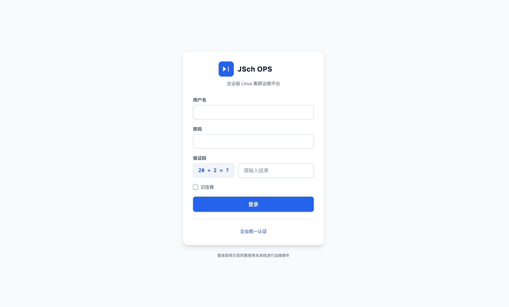
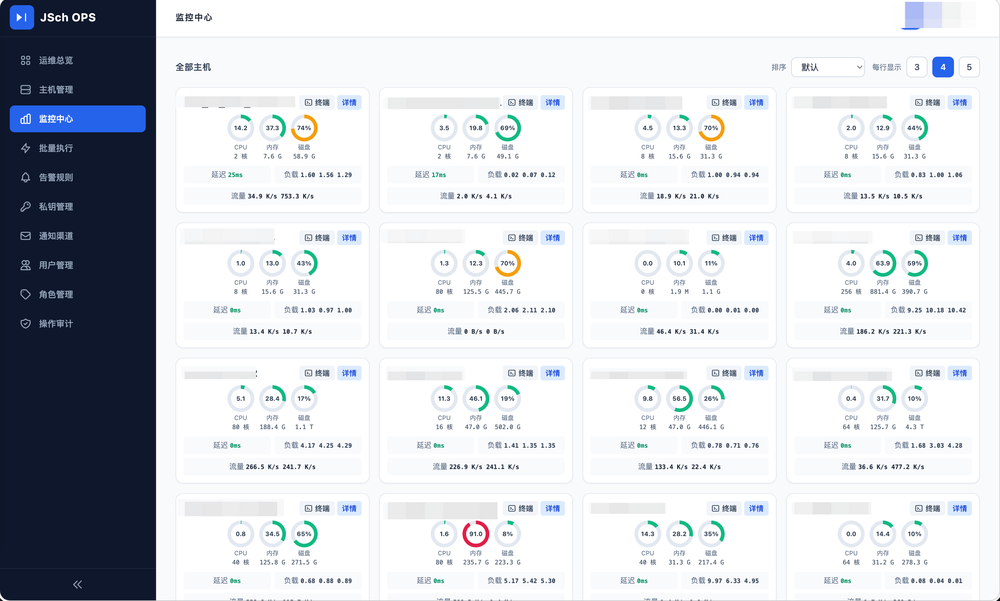
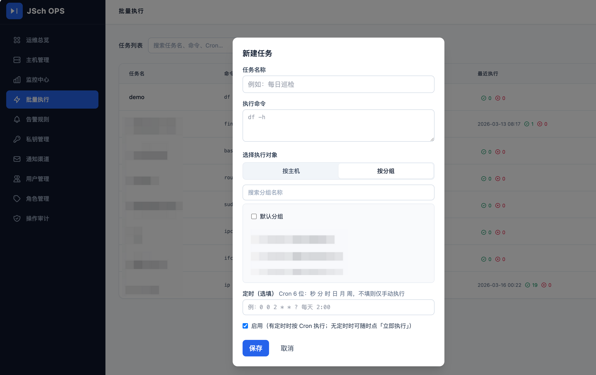
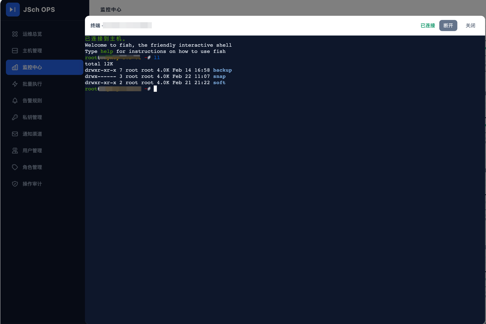

# VOPS

企业级 Linux 集群运维平台：主机与分组管理、SSH 批量执行、监控采集、告警与通知、审计日志；支持账号密码与 OIDC 单点登录。

## 技术栈

| 类别 | 技术 |
|------|------|
| 运行时 | Java 17 |
| 框架 | Spring Boot 2.7.x |
| 视图 | FreeMarker + Tailwind（模板内） |
| 安全 | Apache Shiro（SHA-256 + Salt、角色/主机级权限） |
| 数据 | MySQL 8、MyBatis-Plus |
| 远程 | JSch（SSH 执行命令，支持 OpenSSH 新格式私钥） |
| 缓存 | Spring Cache + Caffeine（首页总览、主机列表、批量列表等） |
| 其他 | Spring Mail（告警邮件）、WebSocket、Spring Scheduling |

## 功能概览

- **主机管理**：分组、密码/私钥认证、SSH 密钥库、主机级权限、在线状态与 CPU/内存/磁盘等指标展示
- **监控中心**：多主机仪表盘、历史曲线、ICMP 与 SSH 采集
- **告警**：规则、主机绑定规则、事件列表、钉钉/飞书/企业微信/邮件等通知渠道
- **批量执行**：多主机命令执行、任务日志、定时任务（Cron）、执行记录与计划时间提示
- **系统**：用户/角色、审计日志、可选 OIDC 登录

## 界面预览

### 主页总览

系统首页展示整体运行状态、关键指标和快速操作入口。

### 监控中心

多主机仪表盘，支持历史曲线查看，集成 ICMP 与 SSH 数据采集。

### 任务管理

批量执行任务的创建、调度与日志追踪，支持定时任务（Cron）。

### SSH 终端

浏览器内嵌 SSH 客户端，直接执行命令，支持多种认证方式。

## 环境要求

- JDK 17+
- Maven 3.6+
- MySQL 5.7+ / 8.x（推荐 utf8mb4）

## 快速开始

### 1. 初始化数据库

```bash
mysql -u root -p < src/main/resources/db/schema.sql
```

按需插入初始管理员用户（`schema.sql` 末尾有注释说明；密码需按系统规则做 SHA256+Salt 写入）。

### 2. 配置

编辑 `src/main/resources/application.properties`（或按环境使用外部配置覆盖）：

| 配置项 | 说明 |
|--------|------|
| `server.port` | HTTP 端口，默认 `18080` |
| `spring.datasource.*` | MySQL 连接 |
| `spring.mail.*` | 邮件告警（SMTP） |
| `oidc.*` | OIDC 单点登录（可选，`oidc.enabled=false` 可关闭） |

**部署在 HTTPS 反向代理后面时**，建议：

```properties
server.forward-headers-strategy=framework
```

使应用识别 `X-Forwarded-Proto`、`X-Forwarded-Host`，OIDC 回调等会生成正确的 `https://` 地址。若代理未透传这些头，可配置 `oidc.redirect-base-url=https://你的对外域名`（见 `OidcProperties`）。

### 3. 编译与运行

```bash
mvn -DskipTests package
java -jar target/vops-1.0.0.jar
```

开发调试：

```bash
mvn spring-boot-run
```

启动后访问：`http://localhost:18080`（端口以配置为准）。

### 4. 脚本（可选）

`src/main/resources/bin/` 下提供 `startup.sh`、`shutdown.sh` 等，可按部署环境调整使用。

## 重要配置说明

### 敏感数据加密

SSH 密码、私钥等使用 AES 加密存储。生产环境务必通过配置或环境变量覆盖默认密钥（见 `VopsApplication` 中 `vops.encrypt.key` 默认值说明），不要使用仓库中的示例值。

### 缓存与定时刷新

部分列表/总览使用 JVM 内 Caffeine 缓存，并由定时任务异步刷新，减轻首屏压力。可选属性（单位毫秒）：

- `vops.index-cache-refresh-interval-ms`（默认 45000）
- `vops.host-list-cache-refresh-interval-ms`
- `vops.batch-list-cache-refresh-interval-ms`

缓存写入 TTL 在 `CacheConfig` 中配置（默认约 60 秒）。

### OIDC

- IdP 侧注册的回调地址须与系统实际对外访问的 **完整 URL** 一致（含 `https`、域名、路径）。
- `oidc.redirect-uri` 可为相对路径（由请求拼接）或完整 URL；与 `buildCallbackUrl` 逻辑一致即可。

## 项目结构（简要）

```
src/main/java/com/vti/vops/
├── config/          # Spring、Shiro、缓存、OIDC 等
├── controller/      # Web 控制器
├── entity/          # 实体
├── mapper/          # MyBatis Mapper
├── service/         # 业务服务
├── monitor/         # 监控采集与解析
├── ssh/             # SSH 客户端封装
├── security/        # Shiro Realm、过滤器、OIDC Token
└── VopsApplication.java
src/main/resources/
├── application.properties
├── templates/       # FreeMarker 页面
├── static/          # 静态资源
└── db/schema.sql    # 建库建表脚本
```

## 许可证

内部/企业使用请遵循贵司政策；未在仓库中声明开源许可证时，默认保留所有权利。

## 贡献与问题

建议在 Issue 或内部工单中描述：环境（JDK、MySQL、是否反向代理）、复现步骤与相关日志（注意脱敏密码与密钥）。
